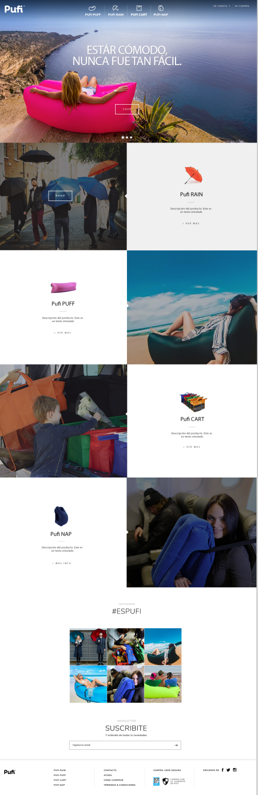

:smiley:**Bienvenid@,**:purple_heart:

Esta es una prueba para IT Globers, desarrollada en React, como preprocesador de estilos use SASS, también  incorpore Redux y conecte con [**https://formspree.io**](https://formspree.io/) para la recolección de datos.

Es una interfaz de diseño integral ideada para comercio, con un diseño de maquetación predeterminado para computador, como se ve en la imágen adjunta.

Se mantiene la línea de diseño y color.

Gracias por el reto, disfruté desarrollarlo y aprender en el proceso.

:hugs:Puedes registrar tu correo en la interfaz [**https://lorenaruiz0717.github.io/PufiTest/index.html**](https://lorenaruiz0717.github.io/PufiTest/index.html) en la sección de suscripción NewsLetter para saber de tu visita.  :speech_balloon:

Gracias por visitarme.

